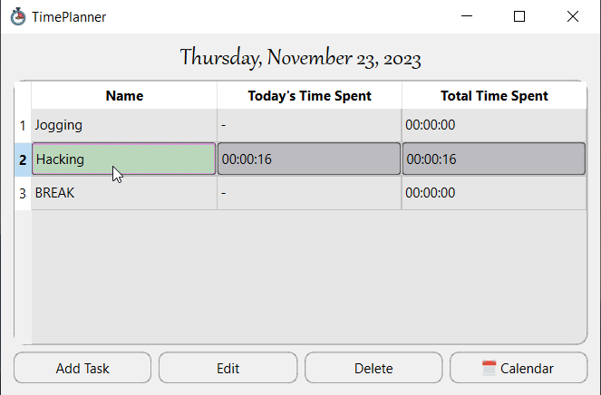

+++
title="Simple Time Planner App with Pyside6"
date=2023-11-23

[taxonomies]
categories = ["python"]
tags = ["python","gui","pyside6"]
+++

# Building a Time Planner with Python and PySide6: A Cross-Platform Approach

## App Interface Overview



# Building a Time Planner with Python and PySide6: A Cross-Platform Approach

## Introduction

Have you ever felt overwhelmed by a busy schedule? This blog post explores the creation of a simple Time Planner app, developed in just a few hours to meet my wife's needs for organizing her time spent on tasks. It utilizes Python's powerful GUI framework, [PySide6](https://doc.qt.io/qtforpython-6/), to achieve this.

## Source Code and Build Instructions

The repository is, as always, available on [my GitHub](https://github.com/luk6xff/TimePlanner).

## PySide6 in Action

PySide6 is the official Python module from the Qt for Python project, offering access to the complete Qt 6.0+ framework and excelling in creating user-friendly interfaces. Here's how it enhances the TimePlanner:

- **Intuitive Layouts:** PySide6's widgets and layout managers facilitate the creation of a clear and organized interface, with task lists, scheduling components, and priority indicators neatly arranged for easy interaction.
- **Seamless User Interaction:** Featuring buttons, text boxes, and other interactive elements, it enables users to add, edit, or mark tasks as complete effortlessly.
- **Cross-Platform Compatibility:** One of its major advantages is ensuring that the app runs smoothly on both Windows and Linux, providing flexibility for users on different operating systems.

## Development Process

1. **Conceptualization:** The goal was to develop an app that allows users to add tasks to a daily list, store them, and start counting the time spent on a selected task upon clicking it.
2. **Environment Setup:** The setup involves installing Python, PySide6, Pillow, and PyInstaller libraries. The development was primarily focused on Windows, as that's my wife's main operating system. To set up, simply run the following commands:
   ```ps1
   .\setup.ps1
   .\venv\Scripts\Activate.ps1
   pip install -r requirements.txt
   ```
3. **GUI Design:** The UI was entirely crafted manually, without the use of the Qt Designer tool, in the method [`init_ui`](https://github.com/luk6xff/TimePlanner/blob/master/main.py#L60).
4. **Functionality Implementation:** The rest of the logic is straightforwardly implemented as part of the [`TimePlanner`](https://github.com/luk6xff/TimePlanner/blob/master/main.py#L25) class, which inherits from `QWidget`.
5. **Storage:** The history of tasks is stored in a `json` file named `tasks.json` in the root folder of your script or executable file.
6. **Local App Build:** To build the app locally, simply run:
   ```ps1
   .\run.ps1
   ```
7. **Standalone Executable Deployment:** A statically linked PE executable can be created using the [PyInstaller tool](https://pyinstaller.org/en/stable/) by running the `.\deploy.ps1` command.

**Benefits and Impact:**

- **Enhanced Organization:** Tasks are clearly listed, prioritized, and easily accessible, fostering better focus and reducing mental clutter.
- **Effective Time Management:** Visual task scheduling aids in allocating time efficiently and avoiding last-minute rushes.
- **Time Control:** The app provides precise tracking of time spent on tasks, which can be useful for filling out timesheets in your company.

**Future Enhancements:**

The app has significant potential for further development, including:

- **Notifications:** Using PySide6 to implement reminders or alerts for upcoming tasks or deadlines, ensuring important tasks are not overlooked.
- **Collaboration Features:** Potential for shared task lists or calendars, facilitating teamwork and project management.
- **Data Synchronization:** Exploring options for syncing task data across devices for seamless access from anywhere.

**Conclusion:**

The TimePlanner app demonstrates the capabilities of Python and PySide6 in quickly creating user-friendly and effective tools. Originally developed for personal use, its core features can benefit anyone looking to optimize their schedule and improve time management skills.
